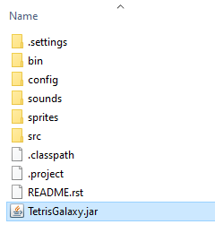

# Tetris Galaxy v1.0.4.1

## Introduction

Tetris Galaxy is a video game inspired by Tetris. In Tetris Galaxy, blocks fall 
from all edges of the screen towards the center. Lines are cleared in concentric 
squares around the center. Tetris Galaxy is a fun variation of Tetris that would 
be enjoyable to any Tetris fan.

### Scope

This guide is for users seeking to install and play Tetris Galaxy.

This guide is *not* for users seeking extensive help to modify Tetris Galaxy.

## Installation

0. If you haven't already, install [Java SE 8](https://www.java.com/en/)
1. Download the Tetris Galaxy directory from [Github](https://www.github.com/swansonmp/tetrisGalaxy)
  


2. Run TetrisGalaxy.jar



## Documentation

Full documentation can be found [here](http://swansonmp.github.io/tetrisGalaxy).

## Troubleshooting

* *Tetris Galaxy isn't working!*
	1. Ensure Java is installed
	2. Ensure TetrisGalaxy.jar is placed in the same directory as all its folders and dependencies

## FAQs

* *How do I know if I have Java?*
	* Windows
		* Select Start -> Control Panel -> Add/Remove Programs
		* If Java is not listed, you must install Java
	* Mac
		* Under System Preferences, click on the Java icon
		* If you do not see a Java icon, you must install Java
* *Where is the pause menu? Where is the main menu?*
	* Menus are the first of many features planned for Tetris Galaxy
* *What is the inspiration for the Tetris Galaxy?*
	* Tetris Galaxy is the result of a single "what if?" from a team of Tetris fans

## Source Code

```
while (!g.startIt()) { wait(150); }
    g.passIn(board, activeSet, scoring, bag);
    try { gameLoop();}
    catch (Exception e) { g.end();}
```

Code for the game loop located in `Game.java`. The graphics driver `g` is 
passed in game information from the previous iteration via the `passIn` method.
Then, the `gameLoop` function computes logic for the next game tick.

Additional source code for Tetris Galaxy can be found on [Github](https://github.com/swansonmp/tetrisGalaxy).

## Support

For additional support, contact [Matthew Swanson](https:github.com/swansonmp)

## License

[Apache 2.0](https://www.apache.org/licenses/LICENSE-2.0)
